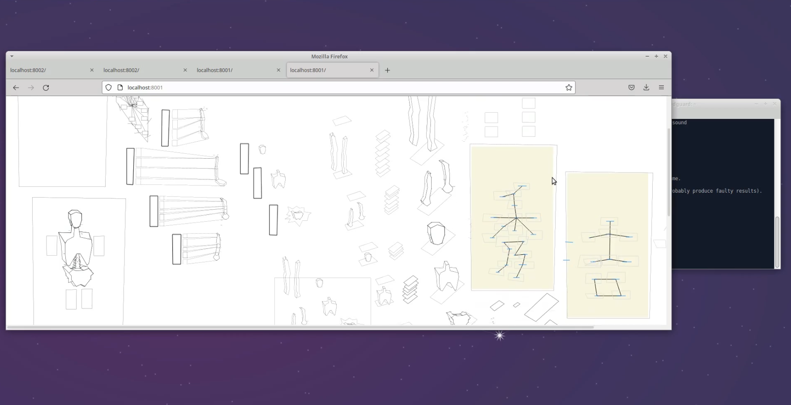

# japanese-capturd-workarea

## Description

[DEMO](https://dguard.github.io/japanese-capturd-workarea/)

## Captures

[workaround/sample-vertical-bounce-handler-into-pass-through-compute.mp4]([url](https://github.com/dguard/japanese-capturd-workarea/blob/main/workaround/sample-vertical-bounce-handler-into-pass-through-compute.mp4))

## Installation

Everything is ready

## Running the app

open `index.html`

## Stay in touch

- Contributor: [Alexander Serditov](https://cv.digitallyconstructed.ru/)

## License

  [MIT license](LICENSE)

